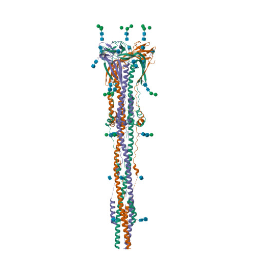

# 🧬 Genomic and Structural Analysis of SARS-CoV-2

## 📌 Overview
This project presents an integrated analysis of genomic and structural data from SARS-CoV-2 using publicly available biological databases. The study combines genome interpretation and protein structure analysis to better understand viral infection mechanisms.

## 🎯 Objectives
- Analyze the complete viral genome (NC_045512.2)
- Identify and interpret key genes (ORF1ab, Spike)
- Explore the 3D structure of the Spike protein (PDB: 6XRA)
- Understand the relationship between protein structure and host cell infection

## 🧪 Methods
- Genomic data retrieved from NCBI (accession NC_045512.2)
- Structural data obtained from Protein Data Bank (PDB ID: 6XRA)
- Functional interpretation of genomic regions and genes
- Structural analysis focusing on trimeric organization, glycosylation, and receptor interaction
- Literature-supported biological interpretation

## 🔬 Key Findings
- The Spike protein exhibits a **trimeric structure** essential for viral function
- Presence of a **glycan shield**, contributing to immune evasion
- The **Receptor Binding Domain (RBD)** plays a central role in binding to ACE2 receptors
- Structural conformation directly influences viral entry into host cells

## 🧬 Biological Insights
- The ORF1ab gene is associated with viral replication mechanisms
- Spike protein is a major **therapeutic and vaccine target**
- Structural features of Spike explain its high infectivity and immune interaction

## 💡 Applications
- Vaccine and antibody development targeting Spike protein
- Identification of antiviral targets
- Support for structural-based drug design

## 🧠 Skills Demonstrated
- Genomic data interpretation (NCBI)
- Structural biology analysis (PDB)
- Integration of multi-omics data
- Scientific writing and data interpretation

## 📂 Project Structure
```
sars-cov2-analysis/
│
├── README.md
├── report.pdf
├── report.docx
└── figures/
    └── figure1.png
```

## 🖼️ Visualization


## 👩‍🔬 Author
Natália Canholato Gomes  
Postgraduate in Bioinformatics